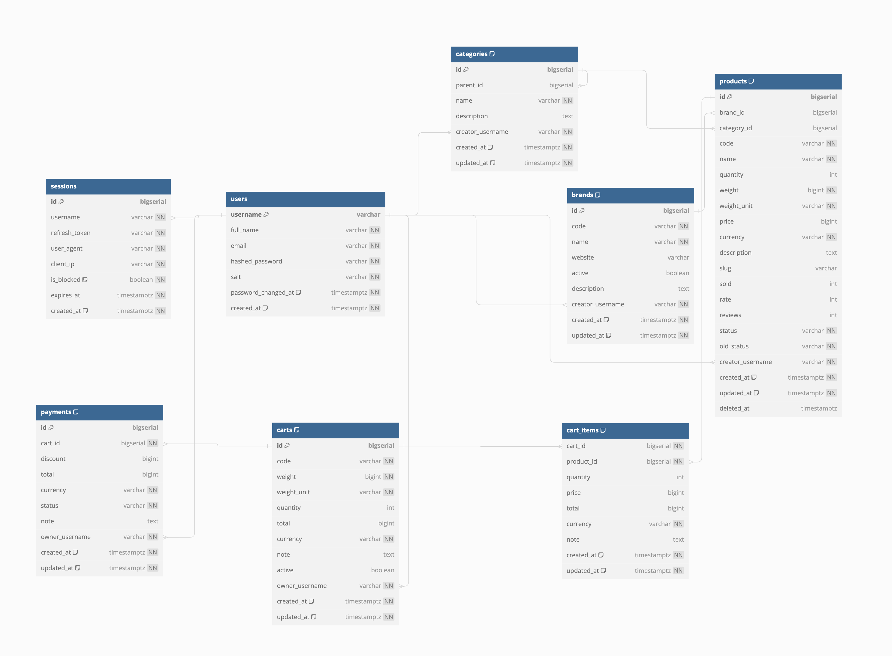

# Exercise 07: Simple E-commerce (GORM)

## 1. Requirement
- Product Management - JWT Auth
```
- POST /products: Create a new product. It receives product details as JSON input.
- PUT /products/{product_id}: Update a product's details. It receives updated product details as JSON input.
- DELETE /products/{product_id}: Delete a product by its ID. GET /products: Retrieve a list of all products.
```

- Shopping Cart - JWT Auth
```
- POST /cart/add: Add items to the cart. It receives a product ID and quantity as JSON input.
- DELETE /cart/remove: Remove items from the cart. It receives a product ID as JSON input.
- POST /cart/checkout: Checkout and clear the cart. It returns a receipt with the total price.
```

## 2. Diagram
- [Detail](https://dbdiagram.io/d/64d1be0e02bd1c4a5e669ab3)


## 3. Install
- Install dependencies
```
make install
```

- Start database
```
make up
```

- Start server
```
make server
```

## 4. APIs
- Test APIs in [ex_07.postman_collection.json](static/ex_07.postman_collection.json)

| Method | Path                  | Description                      | Notes                              |
| ------ | --------------------- | -------------------------------- | ---------------------------------- |
| POST   | `/v1/users/register` | Register a new user              | Receives user details              |
| POST   | `/v1/auth/login`     | Login to get access token        | Receives username and password    |
| POST   | `/v1/products`       | Create a new product             | Receives product details           |
| GET    | `/v1/products/:id`   | Retrieve a product by its ID     | Requires valid product ID         |
| DELETE | `/v1/products/:id`   | Delete a product by its ID       | Requires valid product ID         |
| PUT    | `/v1/products/:id`   | Update a product's details       | Requires valid product ID         |
| GET    | `/v1/cart`           | Retrieve cart details            | Requires authentication           |
| POST   | `/v1/cart/add`       | Add items to the cart            | Receives product ID and quantity   |
| DELETE | `/v1/cart/remove`    | Remove items from the cart       | Requires authentication           |
| POST   | `/v1/cart/checkout`  | Checkout and clear the cart      | Requires authentication           |
